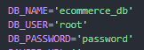

# E-Commerce Backend with MySQL

## Description

This was a project where the ask was to build database models, and define http routes for a Test"E-Commerce Backend". This project uses Sequelize ORM perform CRUD operations without having to use SQL in its traditional sense.

Installation instruction video and demo: [Link to video.](https://drive.google.com/file/d/1rtElGbuZ2P4q31N0mL_9zkfEUGzNIq1m/view)

Node can be installed directly from [https://nodejs.org/en](https://nodejs.org/en).

MySQL can be installed directly from [https://www.mysql.com/downloads/](https://www.mysql.com/downloads/)

All other node packages can be installed by using "npm install" from command-line when in the applications root directory.

This was a project during the Full Stack Web Development Bootcamp at UC Berkeley Ext.

#### Database Running from CLI:


#### Example of a GET Response:


## Installation

For Development:

Installation video: [https://drive.google.com/file/d/1rtElGbuZ2P4q31N0mL_9zkfEUGzNIq1m/view](https://drive.google.com/file/d/1rtElGbuZ2P4q31N0mL_9zkfEUGzNIq1m/view)

1. Clone or fork the repository using "[git@github.com](mailto:git@github.com):MeanBean87/employee-tracker.git"
2. Navigate to the root directory of the project using CLI.
3. Open in the code editor of your choice. ie vs-code.
4. Create a .env file in the root directory and supply it the "DB_NAME", "DB_USER", and "DB_PASSWORD". -note this database / backend is also optionally configured to use Heroku with JawsDb MySQL, if desired to deploy a live service.

   
5. From the root directory, in the command-line use "mysql -u <user_account> -p" and enter your password when prompted.
6. Once connected to MySQL terminal use the command "source ./db/schema.sql" to create the database.
7. Install node modules using "npm install"
8. Seed the database with by running "npm run seed" in the command line from the root directory.
9. Start the database with "npm start".

**MySQL and Node.js will need to be installed by the user.**

Link to MySQL Downloads: [https://www.mysql.com/downloads/](https://www.mysql.com/downloads/)

Link to Node.js Downloads: [https://nodejs.org/en](https://nodejs.org/en)

## Usage

#### Tags Requests

* GET /api/tags - *returns all tags in database*
* GET /api/tags/:id - *returns all tag by id*
* POST /api/tags/  - *creates a new tag*

  Example JSON Body, *Must pass as JSON*:

  ```json
  {
    "tag_name": "New Test Tag"
  }
  ```
* PUT /api/tags/:id - *Updates an existing tag*

  Example JSON Body, *Must pass as JSON*:

  ```json
  {
    "tag_name": "UPDATED Test Tag"
  }
  ```
* DELETE /api/tags/:id - *Deletes/Destroys a tag by id*

#### Categories Requests

* GET /api/categories - *returns all categories in database*
* GET /api/categories/:id - *returns category by id*
* POST /api/categories/  - *creates a new category*

  Example JSON Body, *Must pass as JSON*:

  ```json
  {
    "category_name": "New Test Category"
  }
  ```
* PUT /api/categories/:id - *Updates an existing tag*

  Example JSON Body, *Must pass as JSON*:

  ```json
  {
    "category_name": "UPDATED Test Tag"
  }
  ```
* DELETE /api/categories/:id - *Deletes/Destroys a tag by id*

#### Products Requests

* GET /api/products - *returns all products in database*
* GET /api/products/:id - *returns product by id*
* POST /api/products/  - *creates a new product*

  Example JSON Body, *Must pass as JSON*:

  ```json
  {
    "product_name": "Test Product",
    "price": 200.00,
    "stock": 3,
    "category_id": 1,
    "tagIds": [1, 2, 3, 4, 5, 6]
  }
  ```
* PUT /api/products/:id - *Updates an existing tag*

  Example JSON Body, *Must pass as JSON*:

  ```json
  {
    "product_name": "Updated Test Product",
    "price": 15.99,
    "stock": 30,
    "category_id": 1,
    "tagIds": [1, 2, 3, 4, 5, 6]
  }
  ```
* DELETE /api/categories/:id - *Deletes/Destroys a product by id*

Mozilla Developer Network for HTTP Request Methods:

[https://developer.mozilla.org/en-US/docs/Web/HTTP/Methods](https://developer.mozilla.org/en-US/docs/Web/HTTP/Methods)

## Code Highlights

#### Tag Model:

```javascript
class Tag extends Model {}

Tag.init(
  {
    // define columns
    id: {
      type: DataTypes.INTEGER,
      allowNull: false,
      primaryKey: true,
      autoIncrement: true,
    },
    tag_name: {
      type: DataTypes.STRING,
    },
  },
  {
    sequelize,
    timestamps: false,
    freezeTableName: true,
    underscored: true,
    modelName: "tag",
  }
);
```

#### Category Model:

```javascript
class Category extends Model {}

Category.init(
  {
    id: {
      type: DataTypes.INTEGER,
      allowNull: false,
      primaryKey: true,
      autoIncrement: true,
    },
    category_name: {
      type: DataTypes.STRING,
      allowNull: false,
    },
  },
  {
    sequelize,
    timestamps: false,
    freezeTableName: true,
    underscored: true,
    modelName: "category",
  }
);
```

#### ProductTag Model:

```javascript
class ProductTag extends Model {}

ProductTag.init(
  {
    id: {
      type: DataTypes.INTEGER,
      allowNull: false,
      primaryKey: true,
      autoIncrement: true,
    },
    product_id: {
      type: DataTypes.INTEGER,
      references: {
        model: "product",
        key: "id",
      },
    },
    tag_id: {
      type: DataTypes.INTEGER,
      references: {
        model: "tag",
        key: "id",
      },
    },
  },
  {
    sequelize,
    timestamps: false,
    freezeTableName: true,
    underscored: true,
    modelName: "product_tag",
  }
);
```

#### Product Model:

```javascript
class Product extends Model {}

Product.init(
  {
    id: {
      type:DataTypes.INTEGER,
      allowNull: false,
      primaryKey: true,
      autoIncrement: true,
    },
    product_name: {
      type: DataTypes.STRING,
      allowNull: false,
    },
    price: {
      type: DataTypes.DECIMAL(10,2),
      allowNull: false,
      validate: {
        isDecimal: true,
      }
    },
    stock: {
      type: DataTypes.INTEGER,
      allowNull: false,
      defaultValue: 10,
      validate: {
        isNumeric: true,
      }
    },
    category_id: {
      type: DataTypes.INTEGER,
      references: {
        model: 'category',
        key: 'id',
      }
    }
  },
  {
    sequelize,
    timestamps: false,
    freezeTableName: true,
    underscored: true,
    modelName: 'product',
  }
);

module.exports = Product;
```

## Learning Points

Building MySQL Databases, Tables, and seeding information inside of those tables. Deploying database with backend as a live service on Heroku using JawsDB.

## Badges

[](https://camo.githubusercontent.com/98c6a87dede0251b4484828c3c179da74eece5af481680bb3e32286a345618c3/68747470733a2f2f696d672e736869656c64732e696f2f62616467652f4e6f64652e6a732d31342e782d3333393933333f6c6f676f3d6e6f64652e6a73266c6f676f436f6c6f723d7768697465267374796c653d666c6174) [](https://camo.githubusercontent.com/ad37128eae4f90a292bd75627a4f9b133944c6d8ed0972a308785d0a39c0d34d/68747470733a2f2f696d672e736869656c64732e696f2f62616467652f4d7953514c2d382e302d626c75653f6c6f676f3d6d7973716c266c6f676f436f6c6f723d7768697465267374796c653d666c6174) [](https://camo.githubusercontent.com/806a97f8f171800d790357bc261302aafcbcc40d5edb79f87c950f2d9e32b746/68747470733a2f2f696d672e736869656c64732e696f2f62616467652f4d7953514c322d322e332d626c75653f6c6f676f3d6d7973716c266c6f676f436f6c6f723d7768697465267374796c653d666c6174) [](https://camo.githubusercontent.com/65e648bd1d62bd4035c4a69ff92a7442d29d4d5e875f489152f5c2ab2400ed00/68747470733a2f2f696d672e736869656c64732e696f2f62616467652f4a6176615363726970742d4553362d6637646631653f6c6f676f3d6a617661736372697074266c6f676f436f6c6f723d626c61636b267374796c653d666c6174) [](https://camo.githubusercontent.com/2f538092f7185762c9f8b2be1d57c6c3cf165b89668f383d0b63a2300c6130a1/68747470733a2f2f696d672e736869656c64732e696f2f62616467652f53514c2d537472756374757265645f51756572795f4c616e67756167652d4646413530303f6c6f676f3d73716c266c6f676f436f6c6f723d7768697465267374796c653d666c6174) [](https://github.com/your-profile) [](https://opensource.org/licenses/MIT)

## Author

Michael Mattingly

* [GitHub](https://github.com/MeanBean87)
* [LinkedIn](https://www.linkedin.com/in/michael-mattingly-5580b1280/)

This project was created with source code provided from UC Berkeley Extension.

This project uses the following packages:

* Node.js - [https://nodejs.org/en](https://nodejs.org/en)
* MySQL - [https://www.mysql.com/](https://www.mysql.com/)
* MySQL2 - [https://www.npmjs.com/package/mysql2](https://www.npmjs.com/package/mysql2)
* Sequelize - [https://sequelize.org/](https://sequelize.org/)

## License

This project is licensed under the [MIT License](https://github.com/MeanBean87/readme-generator/blob/main/LICENSE). Please refer to the LICENSE file for more details.
